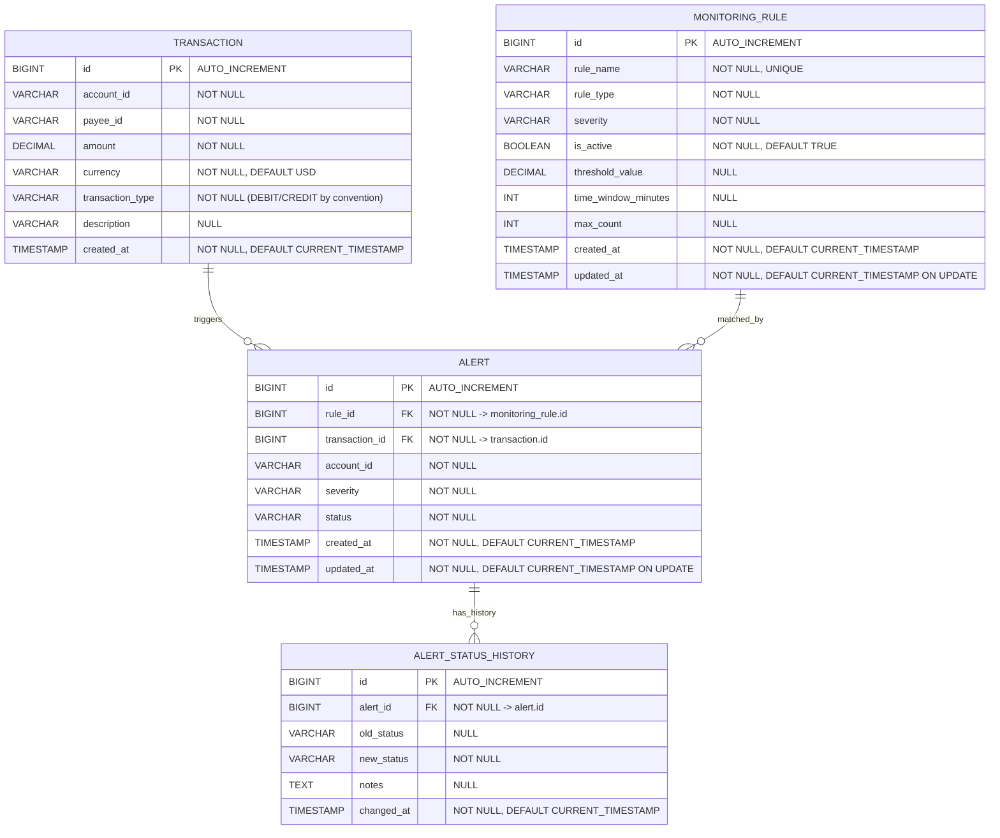

# Transaction Monitoring - Database ER Diagram and Field Rules

> Source: `src/main/resources/schema.sql`
> Goal: show relationships and field requirements in a direct, visual way.

## 1) ER Diagram (Mermaid)



---

## 2) Relationship Meaning (Plain Language)

- One `transaction` can trigger zero or many `alert` rows.
- One `monitoring_rule` can match zero or many `alert` rows.
- One `alert` can have zero or many `alert_status_history` rows.

Quick map:

```text
transaction (1) -----< alert >----- (1) monitoring_rule
                         |
                         v
                 alert_status_history
```

---

## 3) Field Requirements by Table

## Table: `transaction`

| Field | Type | Required | Default | Key/Index | Value rules | Typical use |
|---|---|---|---|---|---|---|
| `id` | BIGINT | Yes | AUTO_INCREMENT | PK | Positive integer | Main identifier, join from `alert.transaction_id` |
| `account_id` | VARCHAR(50) | Yes | - | IDX `idx_account_created` | Account code, non-empty | Filter transactions, velocity/daily checks |
| `payee_id` | VARCHAR(50) | Yes | - | IDX `idx_payee` | Payee code, non-empty | New payee rule |
| `amount` | DECIMAL(15,2) | Yes | - | - | Monetary amount with 2 decimals | Threshold and daily limit rules |
| `currency` | VARCHAR(3) | Yes | `USD` | - | 3-char currency code (ISO style) | Display and future multi-currency logic |
| `transaction_type` | VARCHAR(20) | Yes | - | - | Convention: `DEBIT` or `CREDIT` | Display, possible rule segmentation |
| `description` | VARCHAR(255) | No | NULL | - | Free text | Search/display |
| `created_at` | TIMESTAMP | Yes | CURRENT_TIMESTAMP | IDX `idx_account_created` | UTC recommended | Time-window calculations |

Notes:
- The current Java DTO validates `amount > 0` before insert.
- `transaction` is table name in schema. Keep SQL quoting habits in mind if needed by tools.

## Table: `monitoring_rule`

| Field | Type | Required | Default | Key/Index | Value rules | Typical use |
|---|---|---|---|---|---|---|
| `id` | BIGINT | Yes | AUTO_INCREMENT | PK | Positive integer | Referenced by `alert.rule_id` |
| `rule_name` | VARCHAR(100) | Yes | - | UNIQUE | Human-readable unique name | Admin view/edit |
| `rule_type` | VARCHAR(50) | Yes | - | - | Convention: `AMOUNT_THRESHOLD`, `VELOCITY`, `NEW_PAYEE`, `DAILY_LIMIT` | Switches rule logic |
| `severity` | VARCHAR(20) | Yes | - | - | Convention: `HIGH`, `MEDIUM`, `LOW` | Alert priority color and queue |
| `is_active` | BOOLEAN | Yes | TRUE | - | TRUE/FALSE | Enables or disables a rule |
| `threshold_value` | DECIMAL(15,2) | No | NULL | - | Needed for amount/daily rules | Numeric trigger value |
| `time_window_minutes` | INT | No | NULL | - | Needed for velocity rule | Time window size |
| `max_count` | INT | No | NULL | - | Needed for velocity rule | Max count allowed in window |
| `created_at` | TIMESTAMP | Yes | CURRENT_TIMESTAMP | - | - | Audit |
| `updated_at` | TIMESTAMP | Yes | CURRENT_TIMESTAMP ON UPDATE CURRENT_TIMESTAMP | - | Auto update on row change | Audit |

Rule parameter guidance:

| Rule type | Required fields |
|---|---|
| `AMOUNT_THRESHOLD` | `threshold_value` |
| `VELOCITY` | `time_window_minutes`, `max_count` |
| `NEW_PAYEE` | none of threshold/window/count |
| `DAILY_LIMIT` | `threshold_value` |

## Table: `alert`

| Field | Type | Required | Default | Key/Index | Value rules | Typical use |
|---|---|---|---|---|---|---|
| `id` | BIGINT | Yes | AUTO_INCREMENT | PK | Positive integer | Alert identifier |
| `rule_id` | BIGINT | Yes | - | FK -> `monitoring_rule.id` | Must exist in `monitoring_rule` | Link to triggering rule |
| `transaction_id` | BIGINT | Yes | - | FK -> `transaction.id` | Must exist in `transaction` | Link to triggering transaction |
| `account_id` | VARCHAR(50) | Yes | - | IDX `idx_account_created` | Non-empty | Fast account-level filtering |
| `severity` | VARCHAR(20) | Yes | - | IDX `idx_severity` | Convention: `HIGH/MEDIUM/LOW` | Prioritization |
| `status` | VARCHAR(50) | Yes | - | IDX `idx_status` | Convention: `OPEN/ACKNOWLEDGED/INVESTIGATING/CLOSED/DISMISSED` | Lifecycle workflow |
| `created_at` | TIMESTAMP | Yes | CURRENT_TIMESTAMP | - | - | New alert feed |
| `updated_at` | TIMESTAMP | Yes | CURRENT_TIMESTAMP ON UPDATE CURRENT_TIMESTAMP | - | - | Last status update time |

Lifecycle convention:

```text
OPEN -> ACKNOWLEDGED -> INVESTIGATING -> CLOSED
        \                              \
         -> DISMISSED                   -> DISMISSED
```

## Table: `alert_status_history`

| Field | Type | Required | Default | Key/Index | Value rules | Typical use |
|---|---|---|---|---|---|---|
| `id` | BIGINT | Yes | AUTO_INCREMENT | PK | Positive integer | History row identifier |
| `alert_id` | BIGINT | Yes | - | FK -> `alert.id` | Must exist in `alert` | Group history by alert |
| `old_status` | VARCHAR(50) | No | NULL | - | Previous state text | Timeline |
| `new_status` | VARCHAR(50) | Yes | - | - | New state text | Timeline |
| `notes` | TEXT | No | NULL | - | Optional operator notes | Explain resolution or dismissal |
| `changed_at` | TIMESTAMP | Yes | CURRENT_TIMESTAMP | - | - | Audit timestamp |

---

## 4) Initial Seed Data (Inserted on startup)

In `schema.sql`, initial rows are inserted only into `monitoring_rule` using `INSERT ... WHERE NOT EXISTS`.

Seeded rules:
- `High Value Transaction` (`AMOUNT_THRESHOLD`, `HIGH`, threshold `10000.00`)
- `Rapid Transactions` (`VELOCITY`, `MEDIUM`, window `10`, max_count `5`)
- `New Payee` (`NEW_PAYEE`, `LOW`)
- `Daily Limit Exceeded` (`DAILY_LIMIT`, `HIGH`, threshold `50000.00`)

No seed data is inserted for:
- `transaction`
- `alert`
- `alert_status_history`

---

## 5) Visual Legend

- `PK`: Primary Key
- `FK`: Foreign Key
- `IDX`: Index
- `Required`: `NOT NULL`
- "Convention" means application/business rule expectation; database currently stores it as text.

